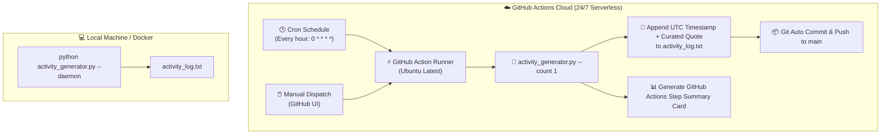

<div align="center">

# 🚀 GitHub Activity Generator (24 Commits / Day)

### *Production-grade, zero-disturbance GitHub commit activity automation in the cloud.*

[](https://github.com/TauqeerMustafa/github-activity-generator/actions)
[](LICENSE)
[](https://www.python.org/)
[](Dockerfile)
[](CONTRIBUTING.md)

<br/>

<p align="center">
  <a href="#-features">Features</a> •
  <a href="#-quick-start-in-2-minutes">Quick Start</a> •
  <a href="#-architecture--how-it-works">Architecture</a> •
  <a href="#-cli-reference">CLI Reference</a> •
  <a href="#-docker-deployment">Docker</a> •
  <a href="#-customization">Customization</a> •
  <a href="#-zero-disturbance-guarantee">Safety Guarantee</a> •
  <a href="#-contributing">Contributing</a>
</p>

</div>

---

## 🌟 Highlights

**GitHub Activity Generator** is an open-source, automated activity engine built to keep your commit history vibrant and consistent (**24 commits daily / 1 commit per hour**) without touching your personal machine or creating noise on your GitHub profile.

```
⏰ 00:00 UTC ──▶ [Commit #1]  "Simplicity is prerequisite for reliability. - Edsger W. Dijkstra"
⏰ 01:00 UTC ──▶ [Commit #2]  "Make it work, make it right, make it fast. - Kent Beck"
...
⏰ 23:00 UTC ──▶ [Commit #24] "Talk is cheap. Show me the code. - Linus Torvalds"
```

---

## ✨ Features

- 🕒 **Hourly Automation (24 Commits / Day)**: Seamlessly scheduled at the top of every hour (`0 * * * *`).
- ☁️ **100% Serverless & Cloud Native**: Runs entirely on GitHub's free runners. No local computer uptime or paid VPS required.
- 🛡️ **Zero Account Disturbance**: Strictly isolated within its own repository. Never touches other repos, organizations, or profile settings.
- 💬 **Curated Wisdom & Clean Logs**: Records real UTC timestamps with inspiring engineering quotes instead of spammy junk files.
- 📊 **Built-in CLI Stats & GitHub Step Summaries**: Generates rich execution reports on both your terminal and GitHub Actions summary tab.
- 🐳 **Docker & Daemon Ready**: Run locally as a background daemon or inside Docker containers with a single command.
- ⚡ **Zero Dependencies**: Pure Python standard library with 100% compatibility across Windows, macOS, and Linux.

---

## 📊 Comparison Matrix

| Feature | 🚀 GitHub Activity Generator | 🚫 Typical Activity Bots |
| :--- | :---: | :---: |
| **Automation Engine** | Native GitHub Actions Cloud (Free) | Requires local PC / VPS running 24/7 |
| **Commit Log Quality** | Timestamped engineering quotes | Random junk / binary garbage |
| **Account Safety** | 100% Isolated to single repo | Risk of noisy repo spam |
| **Commit Frequency** | Balanced hourly (24/day) | Erratic bursts |
| **CI Reporting Cards** | ✅ GitHub Step Summary Markdown | ❌ None |
| **Docker Support** | ✅ Built-in `Dockerfile` & Compose | ❌ None |
| **External Dependencies** | **0** (Pure Standard Library) | Heavy pip packages |

---

## ⚡ Quick Start in 2 Minutes

Get full 24/7 commit automation running in 3 clicks:

### Step 1: Fork or Clone This Repository
Click the **Fork** button at the top right of this page, or clone it:
```bash
git clone https://github.com/TauqeerMustafa/github-activity-generator.git
```

### Step 2: Grant Workflow Permissions
By default, GitHub Actions requires write access to commit back to the repo:
1. In your repository on GitHub, navigate to:  
   👉 **Settings** ➔ **Actions** ➔ **General**
2. Scroll to the **Workflow permissions** section.
3. Select **"Read and write permissions"**.
4. Click **Save**.

### Step 3: Trigger Test Run (Optional)
1. Head over to the **Actions** tab.
2. Select **"Daily Activity Generator (24 Commits / Day)"** on the left menu.
3. Click **"Run workflow"** ➔ **"Run workflow"**.
4. **Done!** From now on, GitHub will automatically create a commit **every hour (24 times every day)**.

---

## 🏛️ Architecture & How It Works



---

## 💻 CLI Reference & Local Usage

The CLI script is versatile and provides a rich set of developer commands:

```bash
# View help menu and options
python activity_generator.py --help

# Generate a single activity entry locally
python activity_generator.py --count 1

# Generate an entry, auto-commit, and push to GitHub
python activity_generator.py --count 1 --commit --push

# View activity analytics & statistics dashboard
python activity_generator.py --stats

# Dry run (test output without touching files or git)
python activity_generator.py --dry-run

# Run as an continuous hourly daemon locally (3600 seconds interval)
python activity_generator.py --daemon --interval 3600 --commit --push
```

### 📊 Built-in Stats Dashboard
Running `python activity_generator.py --stats` gives you instant insights:
```
============================================================
📊 GITHUB ACTIVITY GENERATOR - STATS DASHBOARD
============================================================
📁 Log File Path      : .../github-activity-generator/activity_log.txt
🔢 Total Records      : 24
📅 Active Days Logged : 1 days
🕒 First Activity     : 2026-09-12 14:58:39 UTC
🕒 Latest Activity    : 2026-09-12 15:00:24 UTC
💡 Quote Pool Size    : 32 quotes
⚡ Daily Target Rate  : 24 commits / day (Hourly)
============================================================
```

---

## 🐳 Docker Deployment

Prefer running inside a lightweight container?

### Using Docker Compose
```bash
docker compose up -d
```

### Using Docker CLI
```bash
docker build -t activity-generator .
docker run -d --name activity-generator --restart unless-stopped activity-generator
```

---

## ⚙️ Customization

You can fully customize quotes and commit formats in [`config.json`](config.json):

```json
{
  "log_file": "activity_log.txt",
  "commit_prefix": "chore(activity):",
  "hourly_interval_seconds": 3600,
  "quotes": [
    "Simplicity is prerequisite for reliability. - Edsger W. Dijkstra",
    "Clean code always looks like it was written by someone who cares. - Robert C. Martin",
    "Talk is cheap. Show me the code. - Linus Torvalds"
  ]
}
```

---

## 🛡️ Zero Disturbance Guarantee

We designed this tool with safety, isolation, and cleanliness as top priorities:

1. **Repository Isolation**: Runs strictly inside its dedicated repository. It cannot modify or interact with any other repositories or organization settings.
2. **Clean Commit History**: Uses semantic commit messages (`chore(activity): record activity log at ...`) and human-readable quotes.
3. **No Third-Party Tokens Needed**: Uses native GitHub Actions `GITHUB_TOKEN` permissions—no need to generate or expose personal access tokens.
4. **100% Free**: Uses standard free tier minutes on public GitHub repositories without consuming your quotas.

---

## 🤝 Contributing

Contributions, quote suggestions, and feature requests are warmly welcomed!
- Please read the [Contributing Guidelines](CONTRIBUTING.md).
- Follow our [Code of Conduct](CODE_OF_CONDUCT.md).

---

## 📄 License

This project is licensed under the **MIT License** - see the [LICENSE](LICENSE) file for details.

<div align="center">
  <sub>Built with ❤️ for the open-source community by <a href="https://github.com/TauqeerMustafa">Tauqeer Mustafa</a>.</sub>
</div>
